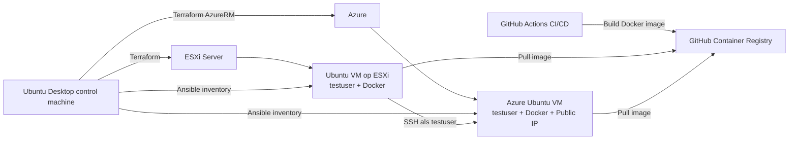

# Ontwerp week 6 hybrid cloud deployment

## Componenten

- ESXi server: lokale/private omgeving.
- Azure: publieke cloudomgeving.
- Ubuntu Desktop: control machine voor Terraform en Ansible.
- Terraform: maakt beide VM's en genereert inventory.
- Ansible: installeert Docker en configureert SSH tussen ESXi VM en Azure VM.
- GitHub Actions: bouwt de Hello World Docker image.

## Datastroom

1. Terraform maakt een VM op ESXi en een VM in Azure.
2. Terraform maakt op beide machines gebruiker `testuser` aan via cloud-init.
3. Terraform genereert de Ansible inventory.
4. Ansible installeert Docker op beide machines.
5. Ansible plaatst de benodigde SSH key op de ESXi VM.
6. Vanaf de ESXi VM kan `testuser` inloggen op de Azure VM.
7. Op beide machines draait dezelfde Hello World Docker container.
